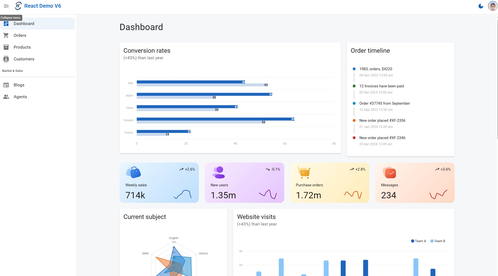
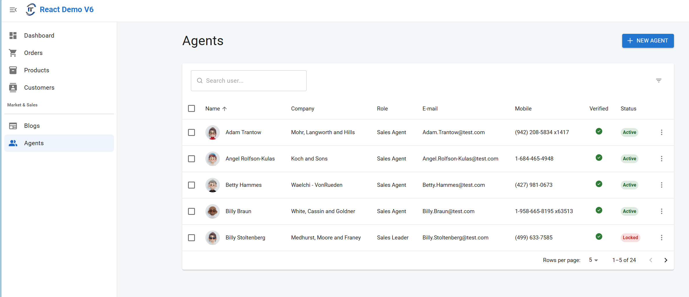
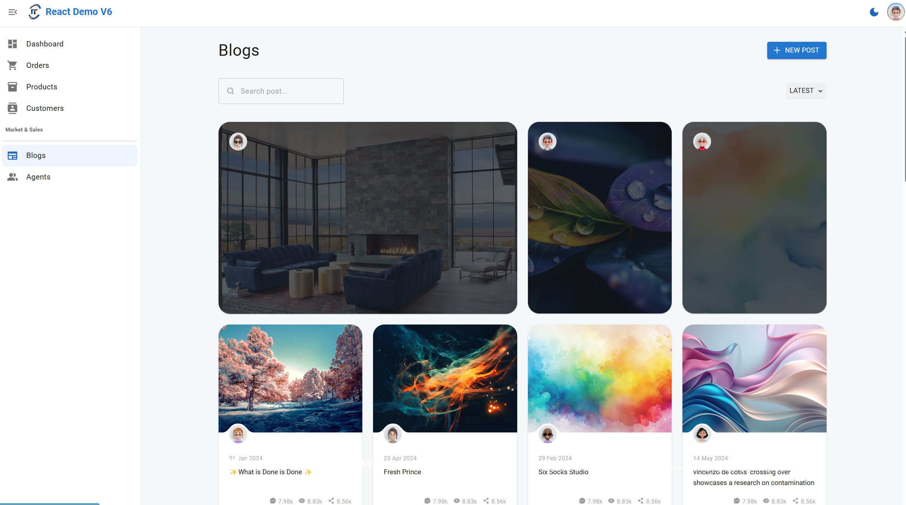
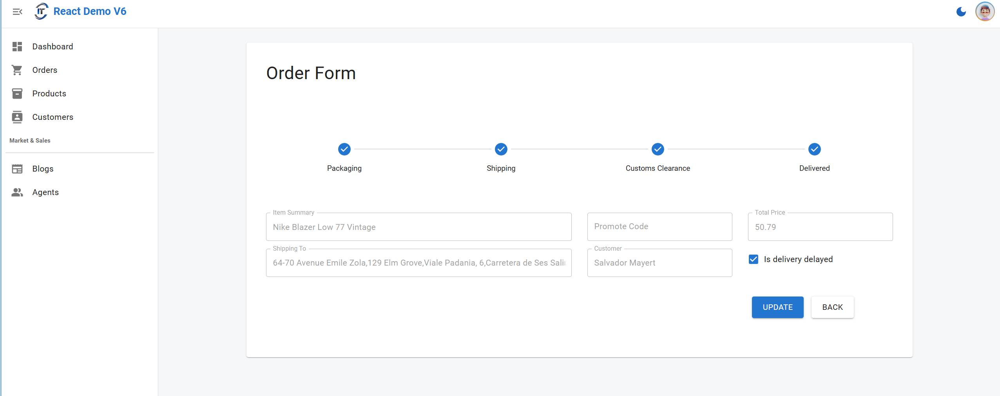

<h1 align="center">
  React Demo v6
</h1>

This react demo is built on the top of my customized React boilerplate with Storybook. 

The boilerplate repo is available [here](https://github.com/harryho/storybook-react-vite-ts-template). 

If you want to build something simpler from scratch, you can follow the README to build your own app step by step.


### Live Demo

[Demo](https://react-demo-v6.harryho.org/) The demo is just a proof of concept. It doesn't have back-end API and all features of master branch.

### Screenshots









<!--  -->

----


## Getting Start


```bash
# Clone project
git clone https://github.com/harryho/react-demo.git


# install the packages with npm
cd react-demo

# development
yarn dev

# build
yarn build


```
